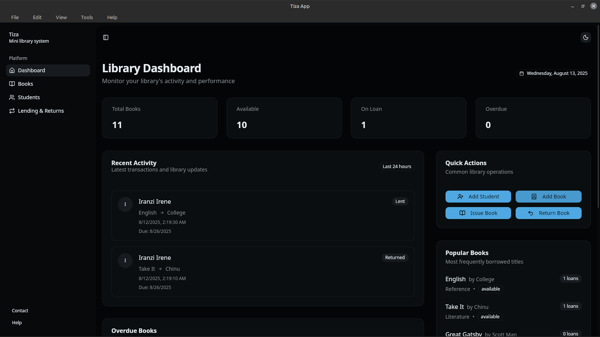

# Tiza - Modern Library Management System

A modern, fast, and secure library management system built with Tauri and Next.js.



## 🚀 Features

- **Lightning Fast**: Built with Rust and Tauri for maximum performance
- **Cross-Platform**: Available for Windows, macOS, and Linux
- **Modern UI**: Clean, intuitive interface built with modern web technologies
- **Secure**: Your data stays on your machine - no cloud dependencies
- **Student Management**: Track student information and borrowing history
- **Book Inventory**: Comprehensive book catalog with search and filtering
- **Lending System**: Easy book checkout and return tracking
- **Reports**: Generate reports in PDF format

## 📥 Download

Visit our [download page](https://nkurunziza-saddy.github.io/tiza) to get the latest version for your platform.

### Quick Download Links

- [Windows (.msi)](https://github.com/nkurunziza-saddy/tiza/releases/latest/download/tiza_x64_en-US.msi)
- [macOS (.dmg)](https://github.com/nkurunziza-saddy/tiza/releases/latest/download/tiza_x64.dmg)
- [Linux (.deb)](https://github.com/nkurunziza-saddy/tiza/releases/latest/download/tiza_amd64.deb)
- [Linux (.rpm)](https://github.com/nkurunziza-saddy/tiza/releases/latest/download/tiza-1.x86_64.rpm)
- [Linux (AppImage)](https://github.com/nkurunziza-saddy/tiza/releases/latest/download/tiza_amd64.AppImage)

## 🛠️ Development

This is a monorepo containing:

- `apps/desktop`: Tauri desktop application
- `apps/web`: Next.js download website

### Prerequisites

- Node.js 18+
- pnpm
- Rust (for desktop app)
- System dependencies for Tauri (see [Tauri prerequisites](https://tauri.app/v1/guides/getting-started/prerequisites))

### Getting Started

1. Clone the repository:

```bash
git clone https://github.com/nkurunziza-saddy/tiza.git
cd tiza
```

2. Install dependencies:

```bash
pnpm install
```

3. Start development servers:

```bash
# Desktop app
pnpm dev:desktop

# Web app
pnpm dev:web
```

### Building

```bash
# Build desktop app for current platform
pnpm build:desktop

# Build web app
pnpm build:web

# Build everything
pnpm build:all
```

## 📖 Documentation

- [Installation Guide](docs/installation.md)
- [User Guide](docs/user-guide.md)
- [Development Guide](docs/development.md)

## 🤝 Contributing

Contributions are welcome! Please feel free to submit a Pull Request.

1. Fork the repository
2. Create your feature branch (`git checkout -b feature/amazing-feature`)
3. Commit your changes (`git commit -m 'Add amazing feature'`)
4. Push to the branch (`git push origin feature/amazing-feature`)
5. Open a Pull Request

## 📝 License

This project is licensed under the MIT License - see the [LICENSE](LICENSE) file for details.

## 🙏 Acknowledgments

- Built with [Tauri](https://tauri.app/)
- Web interface powered by [Next.js](https://nextjs.org/)
- UI components from [shadcn/ui](https://ui.shadcn.com/)

## 📞 Support

If you encounter any issues or have questions:

- [Open an issue](https://github.com/nkurunziza-saddy/tiza/issues)
- Check the [documentation](docs/)

---

Made with ❤️ for librarians everywhere
